## Geometry is important

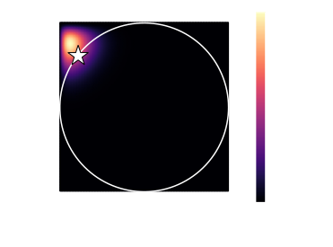

Quantum inference requires optimization w.r.t. **geometric constraints**.

$$\hat{\rho}=\underset{\rho\geq0}{\mathrm{arg\,max}}\operatorname{Pr}
(\mathrm{data}|\rho)$$

## Qubits are trivial

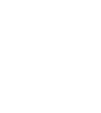

$$\rho=\frac{1}{2}(\mathbb{1}+\mathbf{r}\cdot\boldsymbol{\sigma})$$

$$\rho\geq0\,\Leftrightarrow\,\Vert\mathbf{r}\Vert\leq1\,\Leftrightarrow\,
\operatorname{tr}(\rho^2)\leq1$$

## Higher dimensions are complicated

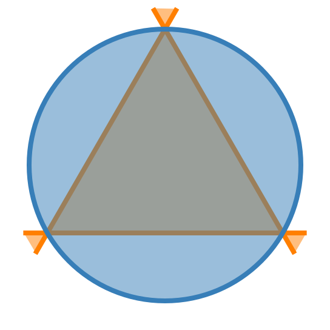

[$\operatorname{tr}(\rho^2)\leq1$]{.blue},
[$\quad3\operatorname{tr}(\rho^2)-2\operatorname{tr}(\rho^3)\leq1$]{.orange}

## Bloch sphere becomes pointed!

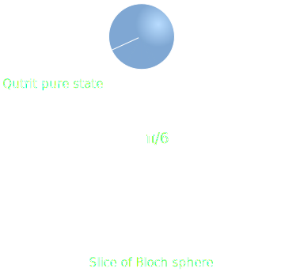

Solid angle measures pointedness:

$$\Omega=\frac{\mathrm{vol}(\text{ball}\cap\text{state-space})}
{\mathrm{vol}(\text{ball})}$$

## Pointedness grows rapidly

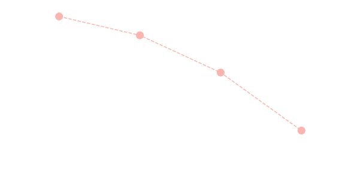

<cite>JAG, Carlton M. Caves, *Rank deficiency and the Euclidean geometry of
quantum states*, APS March Meeting
[A52.00002](http://meetings.aps.org/Meeting/MAR17/Session/A52.2) (2017).</cite>

## Pointedness is important

Gives valuable information about

* Estimator bias  
  <cite>Silva *et al.*, *Investigating bias in maximum-likelihood quantum-state
  tomography*, Phys. Rev. A **95**,
  [022107](https://doi.org/10.1103/PhysRevA.95.022107) (2016).</cite>
* Optimization success probability  
  <cite>Amelunxen *et al.*, *Living on the edge: Phase transitions in convex
  programs with random data*,
  arXiv:[1303.6672](https://arxiv.org/abs/1303.6672).</cite>

## Measurements also important!

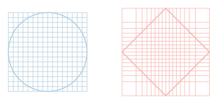

Applications entail measurements, which complicate the geometry!

## Fisher information dictates geometry

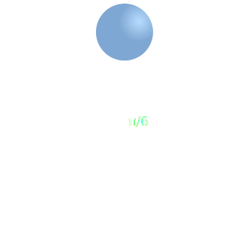

$$F_{jk}(\rho)=\sum_{E\in\text{POVM}}\frac{\operatorname{tr}(E\partial_j\rho)
\operatorname{tr}(E\partial_k\rho)}{\operatorname{tr}(E\rho)}$$

## Fisher information dictates geometry

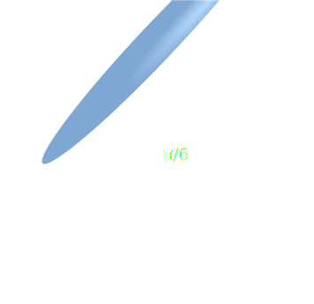

$$F_{jk}(\rho)=\sum_{E\in\text{POVM}}\frac{\operatorname{tr}(E\partial_j\rho)
\operatorname{tr}(E\partial_k\rho)}{\operatorname{tr}(E\rho)}$$

## Quantify difference with condition number

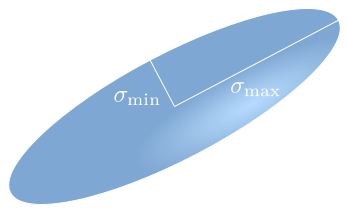

$$\kappa=\sigma_{\mathrm{max}}^2/\sigma_{\mathrm{min}}^2$$

Have proved $\kappa>1$, but how **much** bigger?

<cite>Li *et al.*, *Fisher-symmetric informationally complete measurements for
pure states*, Phys. Rev. Lett. **116**,
[180402](https://doi.org/10.1103/PhysRevLett.116.180402) (2016).</cite>

## Case study: Qutrit

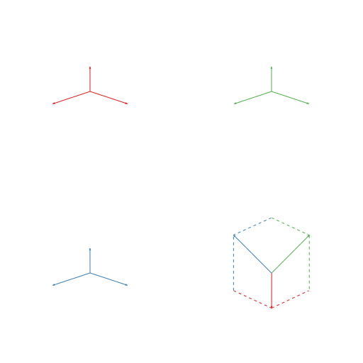

Measure a SIC POVM.

## Case study: Qutrit

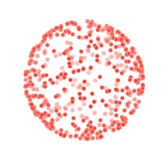

Evaluate Fisher information at $2^{14}$ uniformly sampled pure states.

## Condition numbers are large!

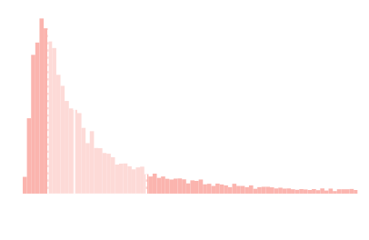

$\operatorname{min}\kappa=3$

## Condition numbers are large!

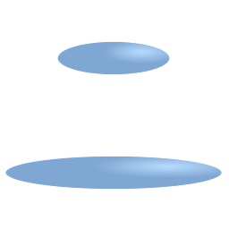

Ellipses at 25th and 75th percentiles

## Ignoring stretching causes errors

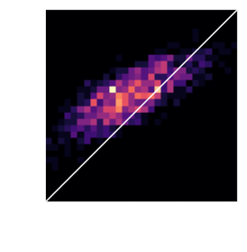

<cite>*Efficient method for computing the maximum-likelihood quantum state from
measurements with additive Gaussian noise*, Smolin *et al.*,
Phys Rev. Lett. **108**,
[070502](https://doi.org/10.1103/PhysRevLett.108.070502) (2017).</cite>

## Ignoring stretching causes errors

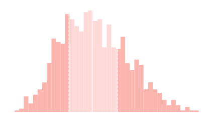

<cite>*Efficient method for computing the maximum-likelihood quantum state from
measurements with additive Gaussian noise*, Smolin *et al.*,
Phys Rev. Lett. **108**,
[070502](https://doi.org/10.1103/PhysRevLett.108.070502) (2017).</cite>

## Need to further quantify anisotropy

[unm.edu/~jagross](https://www.unm.edu/~jagross)

* How does the excess MSE scale with dimension?
* How does anisotropy affect pointedness?
* How does anisotropy change with different measurements?
